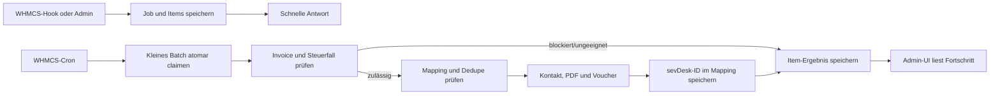

# Zielarchitektur

## Zweck

Das Modul überträgt bestehende WHMCS-Rechnungen als Voucher nach sevDesk. Es verarbeitet auch große Nachläufe unabhängig vom Browser. Vorhandene Zuordnungen werden vor jedem Write geprüft, damit bereits gebuchte Belege nicht erneut angelegt werden.

Das System besteht aus einem WHMCS-Addon, der vorhandenen WHMCS-Datenbank und dem vorhandenen Cron. Für den beschriebenen Umfang ist kein externer Worker- oder Queue-Dienst nötig.

## Systemgrenzen

### Gehört zum Modul

- WHMCS-Addon-Einstiegspunkte für Konfiguration, Aktivierung, Upgrade und Admin-Ausgabe
- WHMCS-Hooks, die einen Export einplanen
- Admin-Oberfläche für Einzeljob, Bulk-Job, Fortschritt, Ergebnisse und Recovery
- Steuerklassifikation und Payload-Aufbau
- sevDesk-HTTP-Client für die benötigten API-v1-Endpunkte
- persistente Jobs samt kurzem Cron-Worker
- Weiterverwendung und Verwaltung der vorhandenen Invoice-Zuordnungen
- zweistufiger Buchungsassistent über `BookingService` und die Jobaktion `book_payment`
- ausdrücklich bestätigte negative Korrektur-Voucher über `CorrectionService` und `correction_voucher`
- bereinigte Diagnosen und Health Checks

### Gehört vorerst nicht dazu

- ein separater Queue-Server oder Daemon
- sevDesk → WHMCS
- sevDesk-Webhooks
- automatische OSS-Voucher
- automatische Refund-, Chargeback-, Gutschrift- oder Storno-Verarbeitung
- Zahlungsbuchung ohne eindeutige read-only Vorschau und explizite Auswahl
- Fuzzy Matching nach Kundenname, ungefähr passendem Betrag oder ähnlichen Merkmalen
- generische Synchronisationsplattform für weitere Buchhaltungssysteme
- externe Lizenzprüfung des Vorgängermoduls und ionCube

## Komponenten

Die Komponenten folgen den fachlichen Grenzen, ohne für jede Methode eine eigene Schicht einzuführen:

| Bereich | Verantwortung |
| --- | --- |
| Addon/Hook | WHMCS-Aufrufe validieren, Job einplanen, sichere Antwort liefern |
| Job-Persistenz | Jobs und Items anlegen, atomar claimen, Lease erneuern, Ergebnis speichern |
| Exportablauf | Invoice laden, Eignung prüfen, Kontakt/PDF/Voucher koordinieren, Mapping abschließen |
| Steuerentscheidung | Kunden- und Rechnungsdaten in einen expliziten Steuerfall übersetzen |
| sevDesk-Client | Authentifizierung, Timeouts, HTTP, Fehlerübersetzung, Response-Validierung |
| BookingService | eindeutige Zahlungsvorschau erzeugen und unmittelbar vor `bookAmount` vollständig neu validieren |
| CorrectionService | bestätigte Rückzahlung als marker- und dedupe-geschützten negativen Revenue-Voucher anlegen |
| Admin-UI | Job starten, Status lesen, Einzelfehler zeigen, zulässige Recovery-Aktionen auslösen |

Controller enthalten keine Steuerlogik und der HTTP-Client kennt keine WHMCS-Tabellen.

## Ablauf



Der Browser startet nur den Job und liest später dessen Status. API-Writes laufen ausschließlich in kurzen Worker-Batches. Ein CLI- oder Cronlauf endet, sobald entweder die konfigurierte Batchgröße oder das interne Zeitbudget erreicht ist. Der nächste Cronlauf setzt die Arbeit fort.

### Zweistufiger Buchungsassistent

Stufe 1 liest nur Daten. Die Adminseite lädt positive `tblaccounts`-Transaktionen anhand des Transaktionsdatums und mit serverseitiger Paginierung. So erfasst sie vollständig bezahlte und offene, teilbezahlte Rechnungen über den gesamten Zeitraum, einschließlich der Einträge nach den ersten zehn Rechnungen.

`BookingService::preview()` prüft für eine positive WHMCS-Zahlung:

1. Die WHMCS-Transaktionsreferenz ist vorhanden.
2. Der gemappte sevDesk-Voucher ist offen, hat dieselbe Währung und einen offenen Betrag, der mindestens der Zahlung entspricht.
3. Genau eine noch ungebuchte `CheckAccountTransaction` enthält die Referenz und stimmt bei Betrag und Kontowährung exakt überein.
4. Bei keinem oder mehreren Treffern wird die Buchung blockiert. Der Fall muss außerhalb dieses Automatikpfads geklärt werden.

Die Vorschau bildet aus Voucher, Banktransaktion, Konto, Betrag, Währung, Datum und Buchungstyp eine gehashte Bestätigungsreferenz. Nur eine ausdrückliche Auswahl legt einen Job vom Typ `payment_booking` mit der Aktion `book_payment` an.

Stufe 2 läuft im Worker. Zuerst prüft er, ob das vollständige aktuelle `mod_sevdesk`-Mapping noch exakt auf den bestätigten Voucher zeigt. Danach lädt er Voucher, Banktransaktion und Konto erneut und wiederholt alle Prüfungen. Dazu gehört der Abgleich des bereits gebuchten Voucherbetrags mit dem Wert aus der Vorschau.

Hat sich die Zuordnung, der bereits gebuchte Voucherbetrag oder ein anderer Wert aus dem bestätigten Snapshot inzwischen geändert, verwirft der Worker den Vorgang. Unmittelbar vor `PUT /Voucher/{id}/bookAmount` speichert er `booking_write_requested`.

Nur ein verifizierbarer `VoucherLog` führt zu `booking_completed` und `succeeded`. Bei einem unbekannten Write-Ausgang bleibt das Item `ambiguous`; der Worker wiederholt den Aufruf nicht.

Der Buchungsassistent verarbeitet keine Refunds oder Chargebacks.

### Zweistufiger Korrektur-Voucher

Stufe 1 ist eine ausdrückliche Adminentscheidung für genau eine WHMCS-Rückzahlung:

- Originalrechnung, vollständiges `mod_sevdesk`-Mapping und sevDesk-Kontakt müssen existieren.
- Rückzahlung und Rechnung müssen dieselbe Währung haben.
- Die Korrekturpositionen werden positiv eingegeben, verwenden konsistent Netto oder Brutto und ergeben innerhalb eines Cents genau den Rückzahlungsbetrag.
- Bei mehreren Steuersätzen ist eine explizite Positionsaufteilung Pflicht.
- Tax Rule, Account-Datev und Raten werden erneut über dieselbe TaxPolicy und `ReceiptGuidance` geprüft.

Nach der Einzelfallbestätigung legt das Modul einen Job vom Typ `refund_correction` mit der Aktion `correction_voucher` an. Die UI darf WHMCS-Rückzahlungen zur manuellen Auswahl anzeigen; Chargebacks, automatische Ausführung und automatische Massenerstellung sind ausgeschlossen.

Stufe 2 prüft WHMCS-Rückzahlung, Originalmapping, Kontakt, Währung, Positionen und Steuerentscheidung erneut. Anschließend sucht `CorrectionService` nach dem gehashten Refund-Marker. Bei genau einem vollständig passenden Voucher stellt der Service die Zuordnung wieder her; mehrere oder widersprüchliche Treffer enden in `ambiguous`.

Einen negativen Revenue-Voucher darf nur ein neues Item anlegen, das noch nie einen Write-Checkpoint erreicht hat und für dessen Marker die Suche keinen Treffer liefert. Unmittelbar vor dem Write speichert es `correction_voucher_write_requested`.

Nach einem möglichen Write darf die Recovery nur noch lesen. Auch wenn die Markersuche dann keinen Treffer findet, bleibt das Item `ambiguous`; ein zweiter POST ist ausgeschlossen.

Einen `CreditNote`-Fallback oder Enshrine-Schritt gibt es nicht. Nach einem bestätigten Write folgen `correction_voucher_created` und `correction_mapping_persisted`.

WHMCS-Kundenguthaben wird separat behandelt. Bei Bulk- und Hook-Exporten blockiert es die Rechnung. Im Einzelexport zeigt der Dry-Run Rechnungsbrutto, Guthaben und verbleibenden Zahlbetrag.

Ein Administrator kann nur `full_gross_voucher` bestätigen. Dabei bleibt der Umsatz-Voucher auf dem vollen Rechnungsbrutto; das Guthaben wird nicht proportional gekürzt und seine Zahlungsbehandlung bleibt separat. Das Jobitem speichert diese Entscheidung unveränderlich, und der Worker prüft sie erneut.

## Bestehender Datenvertrag

### `mod_sevdesk`

`mod_sevdesk` bleibt die verbindliche Zuordnung zwischen einer WHMCS-Invoice und einem sevDesk-Objekt:

| Spalte | Bedeutung |
| --- | --- |
| `id` | technischer Primärschlüssel |
| `invoice_id` | interne `tblinvoices.id` |
| `sevdesk_id` | Remote-ID des sevDesk-Vouchers |

`invoice_id` und `sevdesk_id` bleiben eindeutig. Eine Zeile mit beiden IDs steht für einen abgeschlossenen Export. Bei einer Legacy-Zeile mit `sevdesk_id = NULL` wurde der Export abgebrochen. Der Rewrite legt solche Zwischenzeilen nicht neu an; seine Reservierung liegt im eindeutigen `dedupe_key` des Job-Items.

Ein Korrektur-Voucher ersetzt das Mapping der Originalrechnung nicht. Seine deduplizierte Refund-Referenz und Remote-ID bleiben am abgeschlossenen `correction_voucher`-Item nachvollziehbar. Eine Zahlungsbuchung verändert ebenfalls kein Invoice-Mapping.

Die Tabelle wird weder kopiert noch unter einem neuen Namen aufgebaut. Damit bleibt für bereits exportierte Rechnungen genau eine Zuordnungsquelle erhalten.

### `tbladdonmodules`

Funktionale Einstellungen unter `module = 'sevdesk'` werden weitergelesen:

- `sevdesk_api_key`
- `import_after`
- `import_only_paid`
- `custom_field_id`
- die vorhandenen Konto-Zuordnungen für Inland, EU B2B, EU B2C, Drittland, Kleinunternehmer und Guthaben
- `smallBusinessOwner`

Der Rewrite ergänzt unter anderem `sync_enabled`, `eu_b2b_goods_confirmed`, `eu_b2c_mode`, die zugehörigen `taxRule*`-Werte sowie die ausdrücklichen Bestätigungen für Drittland, AddFunds und Kleinunternehmer. Neue Bestätigungen sind nach Upgrade standardmäßig aus.

Der Rewrite wertet Lizenzfelder nicht aus, lässt sie beim Upgrade aber unangetastet. Operative Werte sind keine normalen Felder in `sevdesk_config()`. Das WHMCS-Standardformular würde den Advisory Lock, die Jobprüfung, das vorübergehende Abschalten der Hooks und die Prüfung über `ReceiptGuidance` umgehen.

Deshalb lassen sich diese Werte nur über die modulinterne, CSRF-geschützte Setupseite ändern. Sie liest bestehende `tbladdonmodules`-Werte weiterhin; das leere Standardformular löscht sie nicht.

## Neue persistente Jobdaten

Zwei additive Tabellen reichen aus.

### `mod_sevdesk_jobs`

Vertrag:

- `id`
- `type` (`single`, `bulk`, `hook`, `recovery`, `payment_booking`, `refund_correction`)
- `status` (`pending`, `running`, `paused`, `completed`, `completed_with_errors`, `cancelled`)
- `filters_json` mit Datumsspanne und fachlichen Filtern, ohne PII
- `requested_by_admin_id` für die WHMCS-Admin-ID, bei Hooks `NULL`
- `total_items` als unveränderlicher Nenner der Fortschrittsanzeige
- `cancel_requested_at` für einen geordneten Abbruch
- `created_at`, `started_at`, `finished_at`, `updated_at`

Ergebniszahlen werden aus den Items gruppiert. Nur `total_items` wird beim Anlegen des Jobs gespeichert, damit der ursprüngliche Umfang auch nach Statuswechseln feststeht.

### `mod_sevdesk_job_items`

Vertrag:

- `id`, `job_id`, `invoice_id`
- `action`: `export_voucher`, `reconcile_voucher`, `book_payment`, `correction_voucher` oder ein reiner Review-Hinweis
- `status` (`pending`, `running`, `retry_wait`, `succeeded`, `skipped`, `permanent_failed`, `ambiguous`, `cancelled`)
- `dedupe_key` als globale, während aktiver oder ungeklärter Arbeit eindeutige Aktionsreferenz
- `checkpoint` als letzter sicher persistierter Ablaufschritt
- kurze, bereinigte `message`
- `attempts`, `available_at`
- `lease_token`, `leased_until`
- `sevdesk_id` als Ergebnisreferenz; für die verbindliche Zuordnung bleibt `mod_sevdesk` maßgeblich
- `transaction_reference` und ein minimales, bereinigtes `candidate_json` für Revalidation und Reconciliation
- `http_status`, `exception_uuid`, `error_code`
- `created_at`, `updated_at`, `finished_at`

Notwendige Constraints:

- Unique auf `dedupe_key`; mehrere abgeschlossene Historieneinträge dürfen denselben fachlichen Fall abbilden, aktive oder ungeklärte Arbeit aber nicht
- Index auf `(job_id, status)`
- Index auf `(status, available_at)`
- Index auf `invoice_id`

Die Tabellen haben keinen Foreign Key zu WHMCS-Kerntabellen. Die Jobtabellen speichern keine Kundenadressen, PDFs, vollständigen Originalinvoices oder API-Rohantworten.

`candidate_json` enthält nur den unveränderlichen Bestätigungssnapshot. Beim Booking sind das die geprüften Objekt-IDs, Beträge, Währung, Datum und Bestätigungsreferenz. Bei der Korrektur kommen die bestätigten Positionen mit Beschreibung, Betrag, Steuersatz und Netto-/Bruttokennzeichen hinzu.

## Zustände und Übergänge

### Job

```text
pending -> running -> completed
                   -> completed_with_errors
pending/running -> paused -> pending/running
pending/running/paused -> cancelled
```

`completed_with_errors` bedeutet, dass jedes Item einen Endzustand hat, aber mindestens ein Item `permanent_failed` oder `ambiguous` ist. `paused` verhindert neue Claims, ohne offene Items umzuschreiben. `cancelled` setzt noch nicht gestartete Items auf `cancelled`; ein bereits laufender Write darf seinen Ausgang noch sichern.

### Item

```text
pending    -> running -> succeeded
                      -> skipped
                      -> permanent_failed
                      -> ambiguous
                      -> retry_wait
retry_wait -> running
pending/retry_wait -> cancelled
permanent_failed/ambiguous -> pending   nur nach explizitem Admin-Retry
```

`manual_review` ist kein Itemstatus. Die UI leitet die Aktion aus `ambiguous` oder einem passenden `error_code` eines `permanent_failed`-Items ab.

Ein Worker setzt `running` nur per atomarem Claim und schreibt dabei `lease_token` sowie `leased_until`. Ein MySQL Advisory Lock verhindert zwei gleichzeitig aktive Runner. Die Item-Lease schützt den Zustand bei einem Prozessabbruch.

Läuft eine Lease ab, entscheidet der Checkpoint über den nächsten Status. Vor einem möglichen Remote-Write geht das Item auf `retry_wait`; ab `contact_write_requested`, `voucher_write_requested` oder einem anderen Write-Checkpoint geht es auf `ambiguous`.

Relevante Checkpoints sind mindestens:

```text
queued
contact_write_requested
contact_linked
pdf_upload_requested
pdf_uploaded
voucher_write_requested
voucher_created
mapping_persisted
booking_write_requested
booking_completed
correction_voucher_write_requested
correction_voucher_created
correction_mapping_persisted
finished
```

Der Worker speichert den Checkpoint vor jedem Write, der sich nicht sicher wiederholen lässt. Kann er das Speichern nicht bestätigen, führt er den Write nicht aus.

## Idempotenz und Reservierung

Die sevDesk-API dokumentiert keinen universellen Idempotency-Key, der die hier beschriebenen Remote-Writes absichert. Darum kombiniert das Modul lokale und fachliche Schutzmaßnahmen:

1. Vor jedem Write `mod_sevdesk` prüfen.
2. Beim Einplanen einen eindeutigen `dedupe_key` aus Aktion und stabiler Geschäftsreferenz setzen: Invoice-ID beim Export, gehashte WHMCS-Zahlungsreferenz beim Booking und gehashte Refund-Referenz bei der Korrektur. Gibt es bereits aktive oder ungeklärte Arbeit, erhält der neue Job ein `skipped`-Item; eine zweite Ausführung für denselben fachlichen Fall wird nicht eingeplant.
3. Vor dem Voucher-Write Mapping und Dedupe-Besitz erneut prüfen. Neue Mappingzeilen entstehen erst mit einer bestätigten Remote-ID; vorhandene Legacy-`NULL`-Zeilen führen zu `ambiguous` und Recovery.
4. Eine stabile WHMCS-Referenz aus Invoice-ID und Rechnungsnummer im Voucher mitführen, damit Recovery remote suchen kann.
5. Erst nach bestätigter Voucher-Erstellung die Remote-ID eintragen und das Item als `succeeded` markieren.
6. Bei einem sicheren terminalen Ausgang darf der Dedupe-Key freigegeben werden.
7. Bei unbekanntem Ausgang nach dem Write wechselt das Item auf `ambiguous`. Der `dedupe_key` bleibt bestehen, bis ein Remote-Abgleich den Fall klärt.

Bei einem sicheren terminalen Ausgang wird der `dedupe_key` freigegeben. Danach verhindert ein vollständiges `mod_sevdesk`-Mapping einen erneuten Voucher. Einen neuen Dedupe-Key erhält ein Admin-Retry erst nach einer ausdrücklichen Adminaktion.

Bestehende `NULL`-Mappings werden beim Upgrade nicht automatisch gelöscht. Sie erscheinen im Recovery-Bericht.

### Markerbasierte Reconciliation

Marker sind Teil der Idempotenz, kein Ersatz für die fachliche Prüfung:

- normaler Voucher: `[WHMCS-INVOICE:<invoice_id>]`
- Korrektur-Voucher: derselbe Invoice-Marker, `[SEVDESK-VOUCHER:<original_id>]` und `[WHMCS-REFUND:<gekürzter SHA-256>]`
- der rohe WHMCS-Refund-Identifier erscheint nicht im Remote-Marker

Vor einem normalen Retry nach unbekanntem Voucher-Write sucht `ReconciliationService` nach dem Invoice-Marker und vergleicht Remote-ID, Kontakt, Währung und Betrag. Vor einem Korrektur-Retry sucht `CorrectionService` rein lesend nach dem Refund-Marker und vergleicht zusätzlich Original-Voucher, Tax Rule und den exakt negativen Rückzahlungsbetrag.

Die Kontakt-Recovery nach `contact_write_requested` sucht ausschließlich über die WHMCS-Kundennummer. Bleibt die Suche ohne Treffer, darf das Modul keinen neuen Kontakt anlegen.

Nur genau ein vollständig passender Treffer darf das lokale Ergebnis ergänzen. Bleibt die Suche nach einem unbekannten Write-Ausgang ohne Treffer oder liefert sie mehrere oder widersprüchliche Treffer, bleibt das Item `ambiguous`, bis ein Administrator den Fall geprüft hat. Der aktive `dedupe_key` bleibt währenddessen erhalten.

`book_payment` verändert bestehende Objekte und hat keinen Voucher-Marker. Dort basiert Recovery auf `booking_write_requested`, den fest gespeicherten Voucher-/Transaction-IDs und einem erneuten Read beider Remote-Zustände.

## Exporttransaktion

Ein Item wird in dieser Reihenfolge verarbeitet:

1. WHMCS-Invoice und Client über dokumentierte WHMCS-Schnittstellen laden.
2. Existenz, Datumsschwelle, Paid-Regel, Währung und Sonderfall prüfen.
3. Negative Positionen, Credits, OSS-Fälle und fachlich unklare Fälle im normalen Invoice-Export blockieren. Eine bestätigte Rückzahlung nutzt ausschließlich den separaten `correction_voucher`-Flow.
4. Steuerfall bestimmen und Konto/Regel/Steuersatz gegen `ReceiptGuidance` validieren.
5. Vorhandenes Mapping sowie Dedupe-Besitz prüfen.
6. Bestehenden sevDesk-Kontakt über das konfigurierte WHMCS-Custom-Field wiederverwenden oder nach dem festgelegten Ablauf anlegen.
7. WHMCS-PDF erzeugen und über `/Voucher/Factory/uploadTempFile` hochladen.
8. Voucher mit Status 100 über `/Voucher/Factory/saveVoucher` anlegen.
9. Remote-ID in `mod_sevdesk` speichern.
10. Item-Ergebnis speichern.

Eine Datenbanktransaktion kann nicht über den HTTP-Call hinweg reichen. Deshalb sichert die Recovery diesen Übergang ab.

## Fehlergrenzen und Retries

| Fehler | Verhalten |
| --- | --- |
| WHMCS-Invoice fehlt | dauerhaft `skipped` oder `permanent_failed`, je nach Ursprung |
| nicht bezahlt/vor `import_after` | `skipped` mit Grund |
| negative Invoice/Credit/OSS/unklare Steuer | im normalen Export `permanent_failed` mit Review-Fehlercode, kein API-Write |
| Booking-Vorschau nicht eindeutig oder veraltet | kein `book_payment`-Write; neue Vorschau erforderlich |
| Refund/Chargeback im Buchungsassistenten | blockiert; keine automatische Buchung |
| Korrektur ohne Bestätigung oder mit unpassenden Positionen | `permanent_failed`, kein Voucher-Write |
| Korrektur-/Booking-Write mit unbekanntem Ausgang | `ambiguous`; checkpoint-/markerbasiert abgleichen |
| 400/409/422 | `permanent_failed`, Payload/Steuerdaten prüfen |
| 401/403 | betroffenen Job pausieren, globalen Auth-Alarm setzen und alle weiteren Runner-Claims stoppen; Zugang im Setup erfolgreich prüfen |
| 404 bei Read | fachlich einordnen, nicht pauschal retryen |
| 429, sicherer Netzwerkfehler, 5xx | `retry_wait` mit begrenztem Backoff und Jitter |
| PHP-/DB-Fehler | Item isolieren, Lease auslaufen lassen, Diagnose ohne PII |
| unbekannter Ausgang nach POST | `ambiguous`, Dedupe bleibt gesetzt, Remote-Abgleich |

Die Zahl der Retries ist begrenzt. Ist die Grenze erreicht, wechselt das Item in einen sichtbaren Endzustand.

## API-Client

Der Client verwendet:

- Basis-URL `https://my.sevdesk.de/api/v1`
- `Authorization` mit dem konfigurierten Token
- `Accept: application/json`
- passenden `Content-Type`
- einen eindeutigen `User-Agent`
- explizite Connect- und Request-Timeouts
- strikte JSON- und Schema-Plausibilitätsprüfung für benötigte Felder

Der Client liefert bereinigte fachliche Exceptions. Controller und Worker müssen keine Guzzle-Klassen kennen.

## Sicherheit und Datenschutz

- Token werden nie in Jobs, Fehlermeldungen oder Admin-HTML geschrieben.
- Logs enthalten Invoice-ID, Job-ID, Aktion, HTTP-Status, sevDesk-Exception-UUID und eine kurze bereinigte Meldung.
- Namen, Adressen, Positionsbeschreibungen und PDFs werden nicht dauerhaft im Joblog dupliziert.
- Admin-Aktionen brauchen WHMCS-Rollenprüfung und CSRF-Schutz.
- Unlink entfernt standardmäßig nur die lokale Zuordnung und verlangt eine Bestätigung. Remote-Löschen gehört nicht in den normalen Recovery-Pfad.

## Admin-Assets

WHMCS bindet die Styles und das kleine Vanilla-JavaScript ausschließlich auf der
Addonseite über `AdminAreaHeadOutput` und `AdminAreaFooterOutput` ein. Die Hooks
lesen die versionierten Dateien aus dem Modulverzeichnis und geben sie innerhalb
der bereits authentifizierten Adminantwort aus. Damit benötigt die Installation
keine öffentliche Webserver-Ausnahme für `/modules/addons/sevdesk/assets`.

## Wann mehr Architektur gerechtfertigt wäre

Ein externer Worker oder Broker ist erst gerechtfertigt, wenn mindestens einer der folgenden Fälle nachweislich eintritt:

- der WHMCS-Cron kann die anfallenden Items trotz sinnvoller Batches nicht zeitnah abarbeiten;
- mehrere WHMCS-Instanzen müssen dieselbe Queue konsumieren;
- der Hostingbetrieb erlaubt keine ausreichend häufigen Cronläufe;
- Retry- und Rate-Limit-Anforderungen lassen sich mit den zwei Tabellen nicht mehr sicher abbilden.

Solange keiner dieser Fälle eintritt, bleiben Addon, Datenbank und Cron ausreichend.
