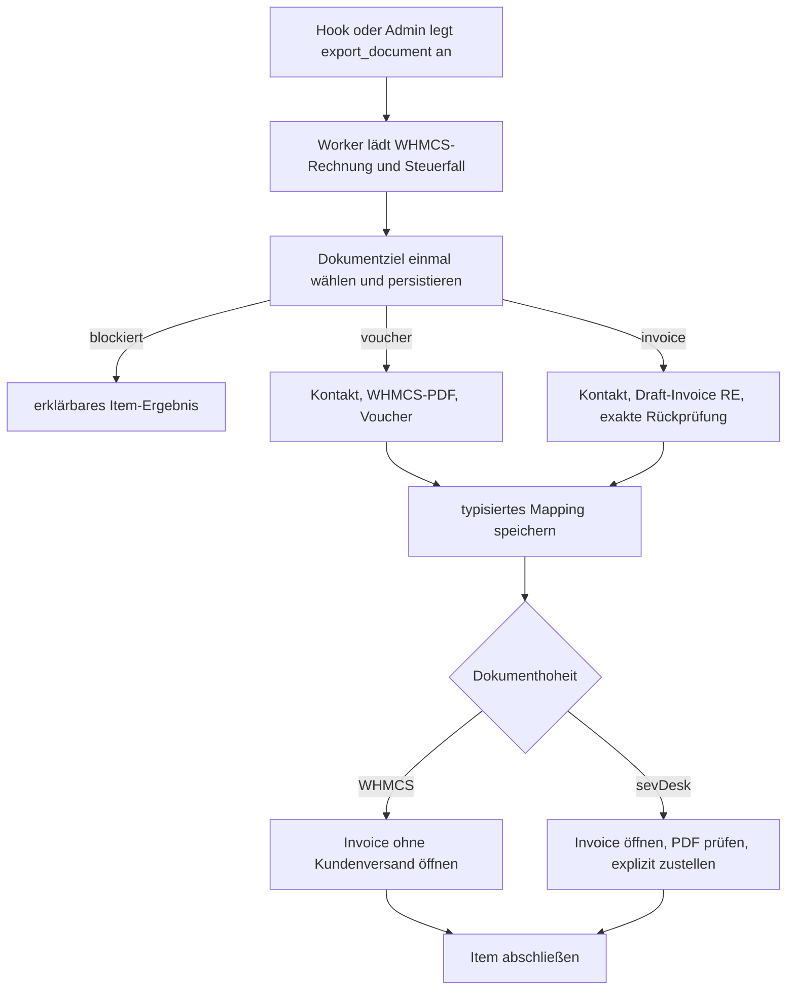

# Zielarchitektur

## Zweck

Das Modul exportiert WHMCS-Rechnungen wahlweise als sevDesk-`Voucher` oder normale sevDesk-`Invoice`. Es verarbeitet auch große Nachläufe unabhängig vom Browser und prüft vorhandene Zuordnungen vor jedem Remote-Write. WHMCS bleibt in allen Modi Billing- und Zahlungsplattform.

Das System besteht weiterhin nur aus dem WHMCS-Addon, der vorhandenen WHMCS-Datenbank, sevDesk API v1 und dem vorhandenen WHMCS-Cron. Ein externer Worker, Broker oder zusätzlicher Dienst ist für diesen Umfang nicht erforderlich.

## Architekturentscheidung: wählbares Exportziel und Dokumenthoheit

**Status:** technisch implementiert; die produktive Aktivierung bleibt bis zum externen Invoice-Canary gesperrt. ZUGFeRD hat zusätzlich ein eigenes Gate.

### Kontext

sevDesk unterstützt OSS-Rules 18 bis 20 bei normalen Invoices, nicht bei Vouchers. Ein vollständiger Wechsel des Bestandsflows wäre dafür nicht nötig und würde unnötig Dokumenthoheit, PDF-Auslieferung und Recovery verändern.

### Entscheidung

Das Modul trennt zwei Entscheidungen:

1. `export_mode` bestimmt das sevDesk-Objekt.
2. `document_authority` bestimmt die kundenseitig maßgebliche Endrechnungs-PDF.

| Dokumenthoheit | `voucher_only` | `invoice_for_oss` | `invoice_only` |
| --- | --- | --- | --- |
| `whmcs` | erlaubt | erlaubt | erlaubt |
| `sevdesk` | nicht erlaubt | nicht erlaubt | erlaubt |

- `voucher_only` ist der Upgrade-Default und erhält den bisherigen Voucher-Pfad.
- `invoice_for_oss` routet ausschließlich Rule 19 für ausdrücklich bestätigte, vollständig elektronische/digitale EU-B2C-Leistungen zu Invoice.
- `invoice_only` routet alle vom freigegebenen Invoice-Vertrag unterstützten Steuerfälle zu Invoice.
- `whmcs` bedeutet: WHMCS-Rechnung und WHMCS-PDF bleiben kundenseitig maßgeblich; eine sevDesk-Invoice wird ohne Kundenversand geöffnet.
- `sevdesk` bedeutet: WHMCS bleibt Billing-, Proforma- und Zahlungsplattform, aber sevDesk liefert nach Zahlung die allein über die normale Kundenoberfläche und Rechnungs-E-Mails ausgelieferte Endrechnungs-PDF. Dieser Modus setzt `sync_enabled=on` voraus; das Setup lehnt eine sevDesk-Hoheit ohne automatische Einreihung ab.

Upgrade-Default ist `document_authority=whmcs`, `export_mode=voucher_only`, `oss_profile=blocked`. Bestehende Installationen behalten diese Dokumententscheidung und ihre Mappings.

Mit 2.1 kommt erstmals eine eindeutige Laufzeitsignatur hinzu. Ein signaturloser 2.0-Bestand startet deshalb einmalig mit `sync_enabled=off` und `runtime_review_required=on`. Die Signatur bestätigt das migrierte lokale Schema; die separate Review-Sperre bleibt bis zur bestätigten Setup-Prüfung bestehen. Sie blockiert automatische und manuelle Remote-Arbeit.

Modus, Hoheit und steuerrelevante Profile lassen sich nicht ändern, solange aktive oder ungeklärte Exportitems existieren. Bestehende Mappings werden durch einen Wechsel nicht neu exportiert. Hooks speichern den beim Einreihen gültigen Exportmodus, die Hoheit, OSS-/EU-B2C-Profile und den Versandkanal im Item. Eine gleichzeitig gespeicherte Setupänderung verändert diese Entscheidung nicht.
Ein bestätigtes Rule-19-OSS-Profil und die frühere Freigabe `eu_b2c_mode=domestic_confirmed` sind gegenseitig ausschließend; das Setup lehnt die widersprüchliche Kombination ab.

### Grenzen

- OSS-v1 unterstützt nur Rule 19 und nur nach der Betreiberbestätigung `rule19_digital_services_confirmed`.
- Positionstexte werden nicht heuristisch als Produkt oder Dienstleistung klassifiziert.
- Rules 18 und 20, gemischte oder unklare Leistungsarten und nicht freigegebene Steuerfälle bleiben blockiert.
- Invoice-Ziele werden nur nach vollständiger WHMCS-Zahlung und mit effektiver WHMCS-Rechnungsnummer erstellt.
  Das ist das getrimmte `invoicenum` oder bei einer Legacy-Zeile ohne separate Nummer die unveränderliche
  `tblinvoices.id`; die Auflösung schreibt nichts in WHMCS zurück.
- Invoice-Positionen erhalten in v1 Menge 1 und kein frei konfiguriertes `accountDatev`.
- Invoice-CreditNotes, B2G/XRechnung und dauerhafte PDF-Spiegelung sind nicht Teil dieser Entscheidung.

### Konsequenzen

Die Fachentscheidung wird vor jedem Remote-Write einmal getroffen und unter `document_type_selected` eingefroren. Zieltyp, Hoheit, Exportmodus, OSS-/EU-B2C-Profil, effektive Rechnungsnummer und Versandkanal werden danach nicht aus der aktuellen globalen Einstellung neu abgeleitet. Nach einem fehlgeschlagenen Voucher-POST findet kein Invoice-Fallback statt. `VoucherExporter` und `InvoiceExporter` bleiben spezialisierte Services; es entsteht keine generische Belegplattform.

Die zulässige Modus-/Hoheits-/OSS-/EU-B2C-/Versandmatrix wird einmal im Dokumentziel-Resolver validiert. Job-Snapshot-Parser, Worker-Preflight und Health verwenden denselben Validator; sie pflegen keine unabhängigen String-Matrizen.

`invoice_only` nutzt eine eigene Invoice-Steuerklassifikation. Sie benötigt weder ein Voucher-`accountDatev` noch `ReceiptGuidance`, übernimmt aber dieselben B2B-, Rule-3-, Bestätigungs- und Steuersatzgrenzen. `invoice_for_oss` verwendet diesen Pfad nur für den bestätigten Rule-19-Fall; alle übrigen Ziele durchlaufen weiterhin den Voucher-Vertrag samt Guidance.

Rule 11 ist die begrenzte Ausnahme: sevDesk wählt das Erlöskonto bei einer Invoice selbst, weil `InvoicePos` kein `accountDatev` annimmt. Deshalb benötigt jede Rule-11-Invoice zusätzlich `small_business_invoice_canary_confirmed`. Vor Setupfreigabe, Dry-Run, Health Check und Worker muss die aktuelle `ReceiptGuidance` außerdem mindestens ein `REVENUE`-Konto ausweisen, das Rule 11 mit 0 % erlaubt. Das Ergebnis dient nur als Mandantenfähigkeit; es wird kein Konto in das Invoice-Payload geschrieben. Voucher mit Rule 11 bleiben beim bisherigen Konto-/Guidance-Vertrag.

Die lokale Unique-Annahme für `sevdesk_id` bleibt erhalten. Der externe Canary muss deshalb bestätigen, dass Voucher- und Invoice-IDs im verwendeten Mandanten sicher eindeutig behandelt werden können. Können IDs kollidieren oder funktionieren Rule 19 beziehungsweise Markerabgleich nicht stabil, wird `invoice_for_oss` nicht freigegeben und diese Architekturentscheidung muss neu bewertet werden.

## Externes Release-Gate: Invoice-API-Canary

Die lokale OpenAPI beschreibt Invoice-Erstellung, PDF, Öffnen, Versand und Buchung als getrennte Schritte, enthält bei einzelnen Feldern aber widersprüchliche Schemaangaben. Ein echter sevDesk-Testmandant muss deshalb vor jeder produktiven Invoice-Aktivierung bestätigen:

- normale Invoice `RE`, Draft-Status 100, Rule 19, kleingeschriebenes `deliveryAddressCountry`, passende `StaticCountry`-Referenz, WHMCS-Steuersatz und kein `accountDatev`;
- unveränderte effektive WHMCS-Rechnungsnummer als `invoiceNumber`;
- stabiler, lesbar abgleichbarer Marker `[WHMCS-INVOICE:<id>]`;
- Pflichtdaten und Referenzen für `SevUser`, `Unity`, Kontakt, Positionen und Adressen;
- Verhalten von `sendBy`, `sendViaEmail`, `getPdf` und `/Invoice/{id}/bookAmount`;
- stabile finale PDF und ID-Eindeutigkeit zwischen Voucher und Invoice.

Dieses Gate kann nicht durch Mocks oder die eingecheckte OpenAPI ersetzt werden. Der technische Live-Lauf hat Rule-19-Create und -Readback, Marker, Nummer, Pflichtreferenzen, Steuersatz, fehlendes `accountDatev`, PDF sowie `sendBy` und `sendViaEmail` bestätigt. Die geprüften Remote-IDs hatten stichprobenweise keinen Treffer beim jeweils anderen Dokumenttyp. Offen bleiben Invoice-`bookAmount` und die fachliche Abnahme. Der WHMCS-Mailkanal ist kein offenes Canary-Gate mehr, sondern auf WHMCS 8.13 technisch ausgeschlossen. `invoice_canary_confirmed` ist eine dokumentierte Betreiberbestätigung des vollständig ausgeführten Canarys, keine automatisierte Behauptung des Moduls.

## Zusätzliches Release-Gate: Rule-11-Invoice-Canary

Der allgemeine Invoice-Canary deckt Rule 11 nicht ab. Ein synthetischer Live-Lauf bestätigte, dass sevDesk einen Rule-11-Entwurf erstellen kann, `sendBy` anschließend aber mit Fehlercode 7100 ablehnt, wenn die Regel für das automatisch gewählte Konto beziehungsweise dessen Scope nicht zulässig ist. Das Modul kann dieses Konto nicht über `InvoicePos.accountDatev` vorgeben, weil das Feld dort nicht unterstützt wird.

`small_business_invoice_canary_confirmed` bleibt beim Upgrade aus. Die Freigabe setzt einen neuen, rabattfreien Rule-11-Lauf im verbundenen Mandanten voraus: Create, exakter Readback, `sendBy`, finale PDF und Recovery ohne zweiten Write. Zusätzlich wird bei jeder relevanten Vorprüfung die aktuelle `ReceiptGuidance` gelesen. Fehlt ein passendes `REVENUE`-Konto für Rule 11 mit 0 %, endet der Vorgang vor Create mit `invoice_rule11_tenant_scope_unsupported`. Ein bereits begonnener Write bleibt ohne weiteren Remote-Aufruf `ambiguous`.

Der Rabatt-Canary ist darauf aufgebaut. `invoice_discount_canary_confirmed` kann Rule 11 nicht allein freigeben.

## Architekturentscheidung: sevDesk-natives ZUGFeRD

**Status:** implementiert. Create, XML/PDF, EN-16931-Prüfung, direkter sevDesk-Versand und der authentifizierte Kundendownload wurden mit synthetischen Daten live geprüft. Zwei WHMCS-Postfachläufe enthielten die WHMCS-Core-PDF statt der sevDesk-PDF. Das ist kein sevDesk- oder Kontextfehler: WHMCS 8.13 ignoriert Binäranhänge aus `EmailPreSend`. Der betroffene Kanal ist auf der Zielplattform gesperrt. Die fachliche Produktivfreigabe bleibt davon getrennt.

Das Modul erzeugt kein eigenes XML. Eine ZUGFeRD-Rechnung bleibt eine normale sevDesk-`Invoice`; das Payload setzt zusätzlich `propertyIsEInvoice=true`, eine bestätigte `PaymentMethod`, eine strukturierte Empfängeradresse und `takeDefaultAddress=false`.

Die Auswahl ist bewusst eng. Sie setzt `invoice_only`, sevDesk-Hoheit, Rule 1, einen deutschen Organisationskunden, ein Admin-only-Tickbox-Opt-in, ein Aktivierungsdatum und den E-Invoice-Canary voraus. Der aktuelle Kontakt muss Käuferreferenz, genau eine passende Haupt-E-Mail, vollständige deutsche Anschrift und `governmentAgency=false` liefern. `SevUser`, `Unity`, `PaymentMethod` und Land werden im aktuellen Mandanten read-only geprüft. Die Pflichtdaten des Rechnungsausstellers lassen sich mit der versionierten API nicht vollständig lesen; ihr Nachweis gehört deshalb zum externen Canary. Eine definitive 422-Ablehnung bleibt ein permanenter Pflichtdatenfehler und führt nie zu einer normalen Invoice als Fallback.

Nach Create und Finalisierung liest das Modul die Invoice und ihre Positionen erneut. Ein von sevDesk zurückgegebenes E-Invoice-Flag muss wahr sein. Fehlt das Feld im Readback, darf der Ablauf nur weitergehen, wenn `getXml` anschließend ein gültiges CII-Dokument liefert; ein ausdrücklich falscher Wert bleibt ein Vertragsfehler. Zusätzlich prüft das Modul Kontakt, PaymentMethod und einen kanonischen Adresshash. Der XML-Hash wird vor dem nächsten Write eingefroren. Ändert sich das XML zwischen Create, `sendBy`, Versand oder Recovery, wird der Vorgang `ambiguous`. Das finale PDF folgt weiter dem vorhandenen Signatur-, Größen- und Hashvertrag.

Der persistierte Jobsnapshot enthält nur IDs, E-Invoice-Flag und SHA-256-Werte. Name, Straße, E-Mail und XML bleiben Laufzeitdaten. `mod_sevdesk.is_e_invoice` und `xml_sha256` ergänzen das Mapping; PDF und XML werden nicht dauerhaft gespiegelt.

Rule 19 bleibt eine normale Invoice. Rules 18/20, B2G/XRechnung, historische E-Rechnungs-Backfills und eine nachträgliche Umwandlung bestehender Dokumente sind ausgeschlossen. Dasselbe gilt für ZUGFeRD mit angewendetem WHMCS-Guthaben, auch wenn die zugrunde liegende Sammelzahlung exakt bewiesen ist. Dafür fehlt ein eigener Create-/XML-Canary; ein stiller Rückfall auf eine PDF-Invoice findet nicht statt.

## Architekturentscheidung: WHMCS-Sammelzahlungen und Rule-11-Rabatte

**Status:** implementiert, der Rabatt-Write bleibt bis zum eigenen sevDesk-Canary gesperrt.

Eine reine WHMCS-Sammelzahlungsrechnung ist ein Zahlungscontainer und kein Umsatzbeleg. Schon der Paid-Hook prüft die vollständige Kette anhand von `relid`, Mandant, Status, Beträgen, Steuerfeldern, `tblaccounts` und Mappingzustand. Nur dann lässt er die normale WHMCS-Mail für den Container zu und reiht die Originalrechnungen ein. Den einmal bestätigten Graphen merkt sich der Hook für den laufenden WHMCS-Request. So führen die Paid-Ereignisse der Originalrechnungen nicht jedes Mal dieselbe Tabellenprüfung aus. Diese Abkürzung gilt nur für Hooks; der Worker liest stets neu.

Der Worker prüft die Struktur zunächst gegen den eingefrorenen Fingerprint und liest sie nach dem WHMCS-Rechnungssnapshot vor der Dokumententscheidung erneut. Direkt vor `voucher_write_requested` oder `invoice_write_requested` folgt eine dritte, frische Prüfung. So kann eine Änderung während PDF-, Kontakt- oder E-Rechnungs-I/O keinen Beleg-POST mehr mit einem veralteten Zahlungsgraphen auslösen. Fingerprint, Elternbeleg, Guthaben, Zahlbetrag und Dokumentbrutto müssen in allen Lesungen und im Snapshot übereinstimmen. Texte, Gateway-Referenzen und `tblcredit` werden nicht ausgewertet. Eine bloße Reihe von `Invoice`-Positionen reicht nicht als Nachweis.

Ein vom Paid-Hook eingereihter Zieljob bleibt zusätzlich an die dabei geprüfte Parent-ID gebunden. Wechselt die Originalrechnung vor dem Worker in eine andere Sammelzahlung oder erscheint sie plötzlich als gewöhnliche Rechnung, endet der alte Job vor dem ersten Remote-Write. Trifft das Paid-Ereignis auf einen bereits wartenden Hybridjob, wird die Parent-ID unter derselben Jobsperre ergänzt. Eine abweichende zweite Parent-ID überschreibt sie nicht, sondern setzt einen dauerhaften Konflikthinweis. Mehrere aktive Elternbelege blockieren den gesamten betroffenen Zahlungsgraphen, also auch Ziele, die selbst nur von einem der Elternbelege referenziert werden.

Die Prüfung umfasst auch den übrigen Rechnungsvertrag: Datum, effektive Nummer, Währung, Steuerart und -werte, alle Positionen sowie die für Steuer- und E-Rechnungsentscheidung nötigen Kundendaten. Im Job landet davon nur ein SHA-256-Wert, keine Adresse und kein Positionstext. Die bereits zugeordnete sevDesk-Kontakt-ID wird getrennt und lesbar gespeichert. Ein leerer Link darf nur auf genau die ID wechseln, die derselbe Workflow ermittelt und als `remoteContactId` festgehalten hat. Kennt die Recovery diese ID bereits, prüft sie ausschließlich den Kontakt per ID und stellt genau diesen lokalen Link wieder her; eine Kundennummernsuche darf den eingefrorenen Empfänger nicht ersetzen. Ein späterer Wechsel von Kontakt A zu B stoppt vor dem Beleg-POST; nach einem möglichen Dokument-Write bleibt der Vorgang `ambiguous` und verwendet für die rein lesende Recovery weiterhin A. Vor einer Kontaktneuanlage sowie vor optionalen Adress- und E-Mail-Writes werden Rechnungsvertrag und Empfängerlink frisch geprüft.

Bei einer Originalrechnung mit exakt bewiesener Kette gilt centgenau `subtotal + tax + tax2 = total + credit`. `tblinvoices.total` ist der direkte Zahlteil, `total + credit` der Dokumentbrutto. Die Summe positiver `tblaccounts`-Buchungen an der Originalrechnung muss deshalb genau `total` entsprechen; bei Vollguthaben sind beide null. Die Sammeltransaktion bleibt beim Container und wird nicht automatisch über `bookAmount` auf einzelne sevDesk-Dokumente verteilt. Fehlt ein Beweis, endet der Vorgang vor dem ersten Remote-Write.

Der einzige freigegebene negative Positionsfall ist genau ein `PromoHosting`-Eintrag, der anhand Typ, `relid` und `taxed` genau einer positiven `Hosting`-Position zugeordnet werden kann. Er wird nicht zur negativen Invoice-Position, sondern zu einem festen `discountSave`. Dieser Pfad setzt `invoice_only`, Rule 11, durchgehend 0 %, EUR, positiven Dokumentbrutto und den separaten Rabatt-Canary voraus. Ein SHA-256 über Anzahl, Text, Betrag, Typ, Relation, Steuerkennzeichen, Netto-/Bruttomodus und Steuersatz wird vor dem Create im Job eingefroren. Derselbe Hash steht als `[WHMCS-DISCOUNT:<sha256>]` neben dem normalen Invoice-Marker. Readback und Recovery verlangen Marker, Rabattsumme, Positionen und Gesamtsumme; eine Drift führt zu `ambiguous`.

## Systemgrenzen

### Drop-in-Upgrade und Kontaktidentität

Der Addon-Name `sevdesk`, die Mappingtabelle `mod_sevdesk` und der Setting-Namensraum in `tbladdonmodules` bleiben erhalten. Der WHMCS-Upgrade-Callback migriert nur lokale Daten. Er löscht und typisiert keine Altzuordnung, bereinigt keine unbekannten Settings, erzeugt keinen Job und ruft sevDesk nicht auf.

Versionsangaben sowie Reste alter Tabellen oder Settings belegen nicht, welcher Code den Bestand zuletzt verwendet hat. Fehlt die Laufzeitsignatur des Rewrites, startet das Modul deshalb gesperrt. Das gilt einmalig auch für den Wechsel von 2.0 auf 2.1.

Vor der ersten Schemainspektion oder DDL speichert das Modul `runtime_review_required=on`, einen neuen Quarantäne-Token und eine ungültige Signatur in einer Transaktion. Ein Setup sieht dadurch nie einen neuen Token zusammen mit einer noch gültigen Signatur. Anschließend schreibt das Modul Signatur, `sync_enabled` und Review-Status zur Absicherung noch einmal unabhängig. Scheitert die erste Transaktion, speichert ein zweiter atomarer Schritt Review und ungültige Signatur.

Die Migration läuft nur weiter, wenn Review-Marker, neuer Token und ungültige Signatur sicher gespeichert sind. Migration und Worker verwenden denselben Advisory Lock. Beim Claim sperrt der Runner zuerst die Settings, dann Job und Item. Ein bereits geclaimtes Item darf enden; nach einer neueren Quarantäne oder einem Zugangsalarm beginnt kein weiteres. Sind Pflichtspalten und Unique-Indizes vollständig, setzt die Migration die gültige Signatur. Der Review-Status bleibt bis zur Setup-Freigabe aktiv. Bei einem Struktur- oder Migrationsfehler bleiben Signatur und Synchronisation ausgeschaltet.

Die Quarantäne sperrt Ereignis-Hooks, Cron/CLI, Schnellaktionen, neue Jobs sowie Resume, Retry und Reconciliation. Pausieren und Abbrechen bleiben als rein lokale Sicherheitsaktionen möglich.

Vor der Setup-Prüfung werden nur abgelaufene Leases lokal eingeordnet. Die Verarbeitung sperrt zuerst den Job und dann das Item und prüft Status, Lease-Token und Ablaufzeit erneut:

- sichere Schritte und bereits bestätigte Remote-Effekte ohne Abbruch werden `retry_wait`;
- sichere Schritte eines abgebrochenen Jobs werden `cancelled`;
- unbekannte Write-Ausgänge und Abbrüche nach bestätigtem Remote-Effekt werden `ambiguous`.

Dabei läuft kein Handler. Authentifizierte Kundendokumente und der Mail-Schutz bleiben in der Review-Quarantäne nur nach erfolgreicher Migration und mit gültiger Laufzeitsignatur verfügbar. Fehlt die Signatur oder ist sie falsch, bleiben auch diese Pfade gesperrt.

`runtime_review_required` darf erst nach erfolgreicher Setup- und Mandantenprüfung per Quarantäne-Token-Vergleich geleert werden. Wurde der Token nach dem Öffnen der Seite erneuert, muss die Seite neu geladen und erneut geprüft werden.

Dieselbe lokale Vorbereitung läuft beim ersten Addon-Adminaufruf, falls WHMCS wegen einer identischen anbieterfremden Versionsnummer keinen Upgrade-Callback ausgelöst hat. „Drop-in“ ist damit eine Deploy-, Daten- und Idempotenzgrenze, keine Behauptung vollständiger Featureparität: laufende Kontaktaktualisierung, automatische Zahlungsbuchung ohne Bestätigung, Produktkonten und Fremdwährungsbelege werden nicht still emuliert. Solche Altbetriebe bleiben bis zu einer ausdrücklichen Übergangsentscheidung mit deaktivierter Synchronisation stehen.

Für bestehende Betreiber ist die im konfigurierten WHMCS-Kunden-Custom-Field gespeicherte Remote-ID die explizite Kontaktzuordnung. Existiert diese ID in sevDesk, wird sie unabhängig von optionalen historischen `customerNumber`-Werten wiederverwendet und nicht automatisch geändert. Ist sie remote nicht mehr vorhanden, wird weder nach einem Ersatz gesucht noch ein neuer Kontakt erzeugt. Nur ein leeres Feld erlaubt die exakte Suche nach der WHMCS-Kundennummer. Eine Neuanlage nach leerem Suchergebnis ist zusätzlich durch die persistierte Betreiberbestätigung `customer_number_contact_creation_confirmed` geschützt; ohne sie endet der Vorgang vor dem Pre-Write-Checkpoint und vor `POST /Contact` als `contact_creation_not_confirmed`. Fehlt einem Suchtreffer die `customerNumber`, liest das Modul dessen ID einzeln nach; lässt sich die Gleichheit auch dann nicht beweisen, blockiert `contact_search_unverifiable` den gesamten Kontaktpfad. Mehrere Treffer bleiben ebenfalls ein Konflikt.

Diese Regel verhindert Duplikate und erhält manuell oder durch das Originalmodul gesetzte Links. Beim erstmaligen Verknüpfen sperrt das Modul Kunde und Custom-Field-Zeile in der WHMCS-Datenbank. Eine gleiche ID gilt als bereits erledigt, eine andere ID oder doppelte Feldzeilen blockieren. Nur ein leeres Feld darf befüllt werden. Sie ist keine bidirektionale Stammdatensynchronisation: Name, Anschrift, E-Mail und Steuerdaten eines bereits verknüpften sevDesk-Kontakts werden durch diesen Exportpfad nicht aktualisiert.

Ist das Custom-Field leer, kann die exakte Kundennummernsuche nur Alt-Kontakte finden, deren sevDesk-`customerNumber` wirklich der internen WHMCS-Client-ID entspricht. Fehlende oder historisch anders vergebene Kundennummern sind vor der Freigabe manuell zu inventarisieren. Erst danach darf der Betreiber die Neuanlage mit diesem Kundennummernvertrag ausdrücklich freigeben.

### Gehört zum Modul

- WHMCS-Addon-Einstiegspunkte für Konfiguration, Aktivierung, Upgrade, Admin- und Client-Ausgabe;
- geschützte Setupseite für Exportmodus, Hoheit, OSS-Profil, SevUser, Unity und Versand;
- Übergangsinventur sowie E-Invoice-Profil mit Admin-Opt-in, PaymentMethod, Aktivierungsdatum und eigenem Canary;
- WHMCS-Hooks, die Arbeit einplanen oder einen eng begrenzten Mailanhang übergeben;
- persistente Jobs mit kurzem Cron-Worker;
- deterministische Steuerentscheidung und dokumentbewusster Zielresolver;
- spezialisierter Voucher- und Invoice-Export samt read-only Reconciliation;
- Weiterverwendung und additive Typisierung vorhandener Invoice-Zuordnungen;
- authentifizierter PDF-Proxy anhand der WHMCS-Invoice-ID;
- Twenty-One-Referenzadapter und kleiner Vertrag für Custom Themes;
- zweistufiger `BookingService` für Voucher und Invoice;
- ausdrücklich bestätigte negative Korrektur-Voucher für Voucher-Mappings;
- bereinigte Diagnosen, Health, Dry-Run, CSV und Mappingansicht.

### Gehört nicht dazu

- externe Queue, Daemon oder generische Synchronisationsplattform;
- sevDesk → WHMCS oder sevDesk-Webhooks;
- automatische Produktklassifikation;
- Rules 18/20 und andere nicht bestätigte Steuerprofile;
- automatischer Wechsel des Dokumenttyps nach einem Write-Fehler;
- automatische Refund-, Chargeback-, Gutschrift- oder Storno-Verarbeitung;
- Invoice-`CreditNote`-Pfad;
- dauerhafte Speicherung der sevDesk-PDF in WHMCS;
- WHMCS-Core-Änderung zum Sperren eines direkt erratenen Core-PDF-Endpunkts;
- externe Lizenzprüfung.

## Komponenten

| Bereich | Verantwortung |
| --- | --- |
| Addon/Hook | WHMCS-Aufrufe validieren, Jobs einplanen, Clientzustand liefern, sichere Antwort geben |
| Job-Persistenz | Jobs/Items anlegen, atomar claimen, Lease erneuern, Checkpoints und Ergebnis speichern |
| `DocumentTargetResolver` | Modus, Hoheit, Tax Rule, Paid-Status und effektive Nummer in genau ein Ziel übersetzen |
| `WhmcsPaymentStructureService` | Sammelzahlungscontainer und exakt bezahlte Originalrechnungen anhand lokaler Struktur unterscheiden |
| `InvoiceItemNormalizer` | genau einen belegten `PromoHosting`-Rabatt in positive Positionen plus festen Invoice-Rabatt zerlegen |
| `VoucherExporter` | WHMCS-PDF hochladen, Voucher erstellen und exakt verifizieren |
| `InvoiceExporter` | normale Invoice erstellen, Positionen verifizieren, öffnen und zustellen |
| `EInvoiceEligibilityService` | ZUGFeRD-Auswahl, Kontakt-/Referenzprüfung und PII-freien Snapshot bestimmen |
| `InvoiceXml` | natives XML laden, strukturell begrenzen und SHA-256 bilden |
| Reconciliation | nach unbekannten Writes nur lesen und genau einen vollständigen Treffer akzeptieren |
| `InvoicePdf` | finale PDF als JSON/Base64 oder direkte PDF-Antwort laden, Signatur/Größe prüfen und SHA-256 bilden |
| Steuerentscheidung | Kundendaten und Invoice-Fakten in einen expliziten Steuerfall übersetzen |
| sevDesk-Client | Authentifizierung, Timeouts, HTTP, Fehlerübersetzung und Response-Validierung |
| `BookingService` | typbewusste Vorschau und vollständige Revalidation vor `bookAmount` |
| `CorrectionService` | bestätigte Rückzahlung ausschließlich für Voucher-Mappings erzeugen |
| Theme-Adapter | Proforma/Pending/Ready/Failure und richtigen Downloadlink im Clientbereich darstellen |
| Admin-UI | Setup, Jobs, Zieltyp, Hoheit, Delivery, Einschränkungen und Recovery bedienen |

Controller enthalten keine Steuerlogik und der HTTP-Client kennt keine WHMCS-Tabellen.

## Exportablauf



Der Browser startet nur einen Job und liest später dessen Status. Remote-I/O läuft im Worker. Ein Cronlauf endet nach Batchgröße oder Zeitbudget; der nächste Lauf setzt sichere Schritte fort.

`module_active` und eine gültige Laufzeitsignatur sind Grundvoraussetzungen. `runtime_review_required` sperrt Runner und Remote-fähige Modulaktionen während Erstinstallation, Fremdersatz, 2.0→2.1-Übergang oder eines Strukturfehlers. Nach der Bestandsfreigabe können bestätigte Adminjobs auch mit ausgeschalteter automatischer Synchronisation laufen.

`sync_enabled` steuert zusätzlich die ereignisgetriebenen Exporthooks. sevDesk-Dokumenthoheit lässt sich deshalb nur mit eingeschalteter Synchronisation speichern. Eine enge Ausnahme gilt für `InvoicePaid` bei einem bereits gesetzten Authentifizierungsalarm: Ist die `invoice_only`-/sevDesk-Konfiguration aktiv, signiert, nicht im Review und durch den Canary bestätigt, darf der Hook trotz der Alarm-Sperre das deduplizierte Pending-Item speichern. Der Alarm verhindert dessen Verarbeitung, bis das Setup den Mandanten geprüft und Sync wieder aktiviert hat.

Invoice-Modi brauchen außerdem `invoice_canary_confirmed` und die vollständigen Setupvoraussetzungen. Der lokale Schutz der Zahlungs-Mail ist kein Exporthook. Er schützt die konfigurierte sevDesk-Hoheit auch während Review-, Authentifizierungs- oder Sync-Pausen.

Jeder 401/403-Pfad versucht zuerst den mandantenweiten Alarm. Sync-Stopp und, im Worker, die Jobpause werden unabhängig davon gespeichert.

Scheitert der Alarm, speichert das Modul `runtime_review_required=on` und einen neuen Quarantäne-Token in einer Transaktion. Die gültige Signatur bleibt dabei erhalten, damit Mail- und PDF-Schutz weiterarbeiten. Scheitert auch die Token-Speicherung, setzt ein zweiter atomarer Schritt Review und ungültige Signatur. Nur wenn beide atomaren Fallbacks scheitern, versucht das Modul den Review-Marker ein letztes Mal einzeln zu setzen. Ein erfolgreich gespeicherter Fallback wird nicht später erneut gesetzt und kann daher keine inzwischen abgeschlossene Setup-Freigabe überschreiben.

### Gefrorene Zielentscheidung

Der Worker entscheidet vor Kontakt-, PDF- oder Dokument-Writes anhand von:

- `export_mode` und `document_authority`;
- bestätigtem `oss_profile`;
- deterministischer Tax-Entscheidung und Rule;
- vollständiger Zahlung;
- einer eindeutigen Zahlungsstruktur bei `Invoice`-Referenzen oder angewendetem Guthaben;
- vorhandener effektiver WHMCS-Rechnungsnummer. Ein leeres Legacy-`invoicenum` wird dabei ausschließlich
  im Speicher durch die interne Invoice-ID ersetzt.

Zieltyp, Hoheit, Modus, OSS-Profil, Rule und Entscheidungsgrund werden im Item-Snapshot gespeichert. Bei Resume oder Recovery gilt dieser Snapshot. Ein zwischenzeitlicher Setupwechsel ändert kein begonnenes Item.

### Voucher-Pfad

Der bestehende Pfad bleibt fachlich unverändert:

1. Mapping, Invoice-Fakten, Steuerentscheidung und Guidance prüfen.
2. Kontakt eindeutig auflösen.
3. WHMCS-PDF lokal validieren und temporär hochladen.
4. Voucher mit Status 100, `taxRule`, `accountDatev` pro Position und Marker anlegen.
5. Remote-Voucher und `VoucherPos` erneut lesen. ID, Typ, Status, Datum, Kontakt,
   Marker, Währung, `taxRule`, eingefrorenes `accountDatev`, Positionen und Summen
   müssen zum WHMCS-Snapshot passen.
6. typisiertes Mapping atomar speichern und Item abschließen.

### Invoice-Pfad

1. Mapping, Paid-Status, effektive Nummer, Tax Rule, Land, Währung, positive Positionen, optionalen freigegebenen Festrabatt, SevUser und Unity prüfen. Für jede Invoice wird genau eine passende `StaticCountry`-ID lesend aufgelöst; kein oder mehr als ein eindeutiger Treffer blockiert vor dem Write. Unmittelbar vor `invoice_write_requested` müssen auch die im Job eingefrorenen SevUser- und Unity-IDs noch im Mandanten vorhanden sein.
2. Kontakt eindeutig auflösen.
3. normale Invoice `RE` im Draft-Status 100 mit unveränderter WHMCS-Nummer, Marker und vollständiger WHMCS-Rechnungsadresse erstellen. `takeDefaultAddress=false` entkoppelt das Dokument von einer möglicherweise fehlenden sevDesk-Kontaktadresse; der bestehende Kontakt wird nicht geändert. Vor dem Write werden nur Länder-ID und PII-freier Adresshash eingefroren.
4. Invoice und Positionen erneut lesen; ID, Nummer, Kontakt, Rule, Status, Währung, Netto/Brutto, Empfängeradresse, Positionen und Summen exakt vergleichen. Rule 19 verlangt außerdem einen zum eingefrorenen Zielland passenden Ländercode.
5. erst danach Remote-ID, `document_type=invoice` und Dokumentnummer atomar mappen.
6. unmittelbar vor `sendBy` oder `sendViaEmail` Draft-Header, Empfängeradresse und alle Positionen nochmals lesend gegen den gefrorenen Snapshot prüfen.
7. Invoice über `sendBy` ohne Kundenversand öffnen oder über den gewählten Versandpfad öffnen und zustellen.
8. finale PDF laden, PDF-Signatur und Größenlimit prüfen und `document_ready_at`/`pdf_sha256` ergänzen; nach Zustellung zusätzlich `delivered_at` setzen.

Bei einer ausgewählten ZUGFeRD-Invoice kommen vor dem Mapping der E-Invoice-Readback und `getXml` hinzu. Das Flag darf im Readback fehlen, aber nie ausdrücklich falsch sein. Ohne gültiges CII-XML entsteht kein Mapping. Nach der Finalisierung muss derselbe XML-Hash erneut vorliegen. Der Versand über sevDesk setzt `sendXml=false`, weil das maßgebliche XML bereits im ZUGFeRD-PDF steckt.

Das WHMCS-PDF wird nicht in eine offizielle sevDesk-Invoice umgewandelt. sevDesk erzeugt die Invoice-PDF selbst.

## Dokumenthoheit, Clientbereich und Versand

### WHMCS-Hoheit

WHMCS-PDF und WHMCS-Endrechnungslink bleiben maßgeblich. Die sevDesk-Invoice wird ohne Kunden-E-Mail über `sendBy` geöffnet. Dieser Modus ist für alle drei Exportmodi zulässig.

### sevDesk-Hoheit

Der Setupwechsel ist nur zulässig, wenn:

- `export_mode=invoice_only`;
- WHMCS-Proforma aktiviert ist;
- ein Adapter-Manifest installiert ist;
- der Betreiber den Theme-Eingriff ausdrücklich bestätigt;
- der Invoice-Canary bestätigt ist;
- Versandkonfiguration und Referenzen gültig sind.

Der Worker prüft Canary, SevUser, Unity sowie bei sevDesk-Hoheit Proforma, aktives Theme-Manifest, Betreiberbestätigung und den eingefrorenen Versandkanal unmittelbar vor dem ersten Invoice-/Versand-Write erneut. Fehlt eine Voraussetzung nach einem möglichen Write, bleibt das Item `ambiguous`; davor wird es ohne Remote-Write beendet.

Die SevUser-/Unity-Prüfung gehört ausschließlich zum frischen Create-Pfad. Sobald ein Invoice-Write begonnen hat, fragt die Recovery diese veränderlichen Referenzlisten nicht erneut ab, sondern prüft das vorhandene Dokument gegen die eingefrorenen IDs.

Vor Zahlung zeigt WHMCS die normale Proforma. Nach Zahlung zeigt der Adapter zunächst einen neutralen Pending-Zustand. Nach `document_ready_at` ersetzt der sevDesk-Download die sichtbaren WHMCS-Endrechnungslinks. Presenter und PDF-Proxy verlangen dafür zusätzlich den lokalen Status `Paid`; eine später auf `Refunded` gesetzte, zuvor fertiggestellte Rechnung bleibt als Originalbeleg abrufbar. Der Proxy prüft den Status vor und nach dem sevDesk-PDF-Abruf, damit eine zwischenzeitlich zurückgesetzte Rechnung keine Endrechnung ausliefert. Andere Zustände liefern keine sevDesk-Endrechnung aus. Im Failure-Zustand wird ebenfalls keine ungeprüfte Endrechnung angeboten.

Der Adaptervertrag erhält mindestens `authority`, `state`, `invoiceNumber` und `downloadUrl`. Die gebündelte Twenty-One-Referenzintegration entfernt bei bezahlten Invoice-only-Fällen alle normalen sichtbaren WHMCS-Endrechnungslinks. Ohne WHMCS-Core-Änderung kann ein direkt erratener Core-PDF-Endpunkt technisch weiter bestehen; zugesichert sind Kundenoberfläche und vom Modul gesteuerte E-Mail-Auslieferung.

### Authentifizierter PDF-Abruf

Der Client fragt ausschließlich mit einer internen WHMCS-Invoice-ID an. Die Route prüft:

- angemeldeten WHMCS-Kunden, Eigentümer der Invoice und das WHMCS-Benutzerrecht `invoices` für diesen Client;
- lokalen Rechnungsstatus `Paid` oder bei bereits fertiggestelltem Mapping `Refunded`;
- vollständiges Mapping mit `document_type=invoice`;
- `document_ready_at` und gültige Remote-ID;
- PDF-MIME, `%PDF`-Signatur, EOF-Marker und Größenlimit;
- SHA-256 gegen den beim Ready-Schritt gespeicherten Wert.

Fremde sevDesk-IDs können nicht als Parameter abgefragt werden. PDF-Bytes werden aus sevDesk gestreamt und nicht dauerhaft in WHMCS gespeichert.
Ein 401/403 beim PDF-Abruf setzt wie die Workerpfade den mandantenweiten Authentifizierungsalarm und deaktiviert die automatische Synchronisation.

### Versandkanäle

1. `sevdesk`: `sendViaEmail` öffnet und versendet mit konfiguriertem Betreff/Text; erlaubt sind nur `{invoice_number}` und `{company_name}`.
2. `whmcs_template`: Der vorbereitete Pfad verwendet `SendEmail` und einen einmaligen In-Memory-Kontext. Auf WHMCS 8.13 kann er nicht sicher ausliefern, weil diese Version Rückgabewerte mit Binäranhängen aus `EmailPreSend` ignoriert. Das erklärt auch, warum ein verbrauchter Kontext keinen richtigen Postfachanhang beweist. WHMCS führt die Unterstützung erst im [9.0-Changelog unter WHMCS-21993](https://docs.whmcs.com/releases/9-0/9-0-change-log/) auf. Setup, Health Check und Worker sperren den Kanal auf der Zielplattform vor dem ersten Invoice-Write. Eine bestehende Auswahl wird nicht automatisch auf sevDesk geändert.

Der Mail-Hook fragt sevDesk nicht ab. Bei `invoice_only` und sevDesk-Hoheit registriert `InvoicePaidPreEmail` vor der ersten WHMCS-Zahlungs-Mail einen lokalen Schutzkontext, sobald `module_active` und die Laufzeitsignatur das aktive Rewrite belegen. Dabei wird noch kein Job angelegt. `InvoicePaid` bleibt der einzige Auslöser für Queue und Zustellung.

Der Schutz bleibt auch während Review-, Authentifizierungs-, Canary- oder Sync-Pausen aktiv. So fällt die Dokumenthoheit bei einer Betriebsstörung nicht unbemerkt auf eine WHMCS-Endrechnung zurück. Ist bereits ein Authentifizierungsalarm gesetzt, darf `InvoicePaid` unter den beschriebenen Runtime- und Canary-Bedingungen das deduplizierte Exportitem speichern. Der Kundenbereich erhält damit einen dauerhaften Pending-Zustand; der Runner darf das Item wegen des Alarms noch nicht verarbeiten.

Bestehende Mappings behalten ihren gespeicherten Dokumentkontext. Spätere Invoice-Mails werden anhand dieses Mapping- oder Jobkontexts blockiert. Nur der genau vorregistrierte In-Memory-Anhang darf passieren. Lässt sich bei einer späteren Mail weder aus Templateart noch aus Mapping oder Job die gespeicherte Hoheit bestimmen und gibt es keinen lokalen Schutzkontext, protokolliert der Hook den Fehler bereinigt. Er unterdrückt dann nicht pauschal alle WHMCS-Mails und verwendet auch nicht die aktuelle globale Hoheit als Ersatz.

Bei einer alten Mappingzeile ohne `document_authority` darf die Adminbestätigung eine bereits eingefrorene Jobentscheidung nur übernehmen, nicht ändern. Typ oder Hoheit, die dem Altjob widersprechen, werden vor der Remote-Bestätigung und nochmals im Persistenz-Callback abgewiesen. Als final gelten bei der read-only Prüfung die sevDesk-Invoice-Status 200, 750 und 1000; Draft 100 reicht nicht.

Manuelle Invoice-Mailaktionen bei gestörter lokaler Datenbank bleiben ein Betriebsfehler. Das Modul erstellt oder verändert keine Mailvorlagen. Der direkte Versand auf der Zielplattform erfolgt ausschließlich über sevDesk. Eine spätere Freigabe des WHMCS-Kanals braucht mindestens eine unterstützte WHMCS-Version und einen neuen End-to-End-Anhangstest.

Bulk- und historische Imports setzen keine automatische Zustellung. Eine spätere Zustellung braucht eine eigene Bestätigung. Nach `invoice_delivery_write_requested` oder `whmcs_email_write_requested` wird ein unbekannter Ausgang `ambiguous`; eine manuelle Wiederholung verlangt einen Doppelversand-Hinweis. Ist `whmcs_email_handed_off` bereits dauerhaft gespeichert, vervollständigt Recovery ausschließlich lokale Mapping-Metadaten und ruft weder `SendEmail` noch PDF-/sevDesk-Endpunkte erneut auf.

## Bestehender Datenvertrag

### `mod_sevdesk`

`mod_sevdesk` bleibt die einzige verbindliche Zuordnung zwischen einer WHMCS-Invoice und genau einem sevDesk-Dokument:

| Spalte | Bedeutung |
| --- | --- |
| `id` | technischer Primärschlüssel |
| `invoice_id` | interne `tblinvoices.id`, weiterhin eindeutig |
| `sevdesk_id` | Remote-ID, weiterhin eindeutig |
| `document_type` | `voucher`, `invoice` oder bei ungeprüftem Legacy-Bestand `NULL` |
| `document_authority` | `whmcs`, `sevdesk` oder bei ungeprüftem Legacy-Bestand `NULL` |
| `document_number` | bestätigte Dokumentnummer |
| `document_ready_at` | finale kundenseitig verwendbare Invoice-PDF geprüft |
| `delivered_at` | Versand-Write nachweisbar abgeschlossen beziehungsweise übergeben |
| `pdf_sha256` | Hash der geprüften finalen Invoice-PDF, keine PDF-Kopie |
| `is_e_invoice` | `1` für eine geprüfte native ZUGFeRD-Invoice, `0` für neue normale Dokumente, `NULL` bei historischem Bestand |
| `xml_sha256` | Hash des geprüften nativen XML, keine XML-Kopie |

Eine Legacy-Zeile mit `sevdesk_id = NULL` ist kein Erfolg und bleibt ein Recovery-Fall. Vollständige Alt-Mappings gelten nicht automatisch als Voucher. Die lesende Prüfung ruft dieselbe ID getrennt als Voucher und Invoice ab. Nur genau ein Treffer mit passender Objektart, Remote-ID und exakter WHMCS-Dokumentnummer darf einen Typ vorschlagen; eine Adminbestätigung ergänzt Typ und Hoheit anschließend gemeinsam.

Für neue Dokumente des Rewrites ist der Marker Pflicht. Bei Belegen des Originalmoduls darf er fehlen; die Oberfläche zeigt dann einen schwächeren Legacy-Nachweis. Abweichende oder mehrfache Marker und eine ID-Kollision zwischen Voucher und Invoice blockieren die Typisierung. Die Bestätigung wiederholt beide Remote-Abfragen. Neue Mappingzeilen speichern Remote-ID, Typ und Hoheit atomar. Ein späterer Job- oder Setupwechsel darf die gespeicherte Hoheit nicht umdeuten. Fehlt sie bei einem Altbestand noch, darf ausschließlich ein passender eingefrorener Altjob vorübergehend als Nachweis dienen; widersprüchliche Nachweise sperren beide Auslieferungswege.

Ein Korrektur-Voucher ersetzt das Originalmapping nicht. Seine Marker und Remote-ID bleiben am abgeschlossenen `correction_voucher`-Item. Eine Zahlungsbuchung verändert das Mapping ebenfalls nicht.

### `tbladdonmodules`

Funktionale Legacy-Einstellungen bleiben erhalten. Hinzu kommen insbesondere:

- `export_mode`: `voucher_only`, `invoice_for_oss`, `invoice_only`;
- `document_authority`: `whmcs`, `sevdesk`;
- `oss_profile`: `blocked`, `rule19_digital_services_confirmed`;
- `invoice_canary_confirmed`;
- `small_business_invoice_canary_confirmed`;
- `invoice_discount_canary_confirmed`;
- `invoice_sev_user_id`, `invoice_unity_id`;
- `e_invoice_mode`, `e_invoice_client_field_id`, `e_invoice_payment_method_id`, `e_invoice_active_from`, `e_invoice_canary_confirmed`;
- `invoice_delivery_channel`;
- `whmcs_invoice_email_template`;
- `sevdesk_email_subject`, `sevdesk_email_body`;
- `theme_adapter_confirmed`;
- `customer_number_contact_creation_confirmed` als standardmäßig deaktiviertes Gate für neue Kontakte nach leerer exakter Kundennummernsuche.

Operative Werte werden ausschließlich über die CSRF-geschützte Setupseite geändert. Unbekannte Altwerte und Lizenzfelder bleiben beim Upgrade unangetastet.

## Persistente Jobdaten

Die vorhandenen Tabellen `mod_sevdesk_jobs` und `mod_sevdesk_job_items` bleiben ausreichend. Neue Exporte verwenden `action=export_document`. `export_voucher` und `reconcile_voucher` bleiben für bestehende Jobs und Recovery lesbar.

Der Dedupe-Key bleibt absichtlich `export_voucher:<invoiceId>` für beide neuen Zieltypen. Dadurch können ein alter Voucherjob und ein neuer Invoicejob nie parallel unterschiedliche Remote-Dokumente für dieselbe WHMCS-Invoice erzeugen.

`candidate_json` enthält nur den unveränderlichen Entscheidungssnapshot sowie für Booking/Korrektur die bereits dokumentierten minimalen Bestätigungswerte. Für jede normale Invoice werden Länder-ID und Adresshash eingefroren; für ZUGFeRD zusätzlich E-Invoice-Flag, Kontakt-, PaymentMethod-, Unity- und XML-Hash. Es enthält keine vollständige Invoice, Kundenadresse, PDF, XML oder API-Rohantwort. Fehlt oder widerspricht der normale Adresssnapshot nach einem möglichen Invoice-Write, sind Reconciliation und Öffnung gesperrt.

Das globale Kleinunternehmerprofil kann optional mit `small_business_until` begrenzt werden. Die Steuerentscheidung vergleicht diesen Stichtag mit dem unveränderlichen Rechnungsdatum; Korrekturen verwenden das Datum der Originalrechnung. Ein leeres Feld erhält die bisherige unbegrenzte Semantik. Bei aktivem Kleinunternehmerprofil führt ein syntaktisch oder kalendarisch ungültiger Altwert vor jedem Write zu einem Fehler.

Vor einer Änderung von Modus, Hoheit, OSS-, E-Invoice-, Rule-11-Invoice-, Rabatt-Canary- oder Kleinunternehmerprofil zeigt das Setup eine rein lokale Übergangsinventur. Sie zählt typisierte und untypisierte Mappings, `NULL`- und verwaiste Zeilen, aktive, fehlgeschlagene und unklare Exportjobs sowie bezahlte ungemappte Rechnungen. Ein Fingerprint verhindert die Freigabe einer inzwischen veralteten Ansicht. Aktive oder unklare Exportjobs sperren außerdem Änderungen am Kleinunternehmerschalter, seinem Stichtag, Rule-11-Konto und den beiden Rule-11-Freigaben.

Ein Moduswechsel startet keinen Nachlauf. Alte fehlgeschlagene Exportitems behalten ihren historischen Zielpfad. Sichere Zustände vor einem Dokument-Write können nach neuer Vorschau als eigenes mailfreies `export_document`-Item eingereiht werden; riskante Zustände bleiben Reconciliation-Fälle. Der Sammelexport markiert seinen Job als historischen Backfill, schaltet E-Invoice aus und prüft vor jedem Create Invoice-Nummer, Datum/Kontakt/Betrag sowie markerlose und markertragende Voucher-Kandidaten.

Eine vollständige lokale Zuordnung lässt sich nur entfernen, wenn Voucher und Invoice unter der gespeicherten ID nachweislich mit 404 fehlen. Das Mapping wird danach unter Lock nochmals gegen Remote-ID und Dokumenttyp geprüft. Ein vorhandener oder nicht eindeutig prüfbarer Remote-Beleg bleibt geschützt.

### `mod_sevdesk_jobs`

Der bestehende Vertrag bleibt:

- `id`, `type`, `status`, `filters_json`, `requested_by_admin_id`;
- unveränderliches `total_items` für die Fortschrittsanzeige;
- `cancel_requested_at`, `created_at`, `started_at`, `finished_at`, `updated_at`.

Ergebniszahlen werden aus Items gruppiert. Jobtypen bleiben unter anderem `single`, `bulk`, `hook`, `recovery`, `payment_booking` und `refund_correction`.

### `mod_sevdesk_job_items`

Ein Item enthält weiterhin nur technische Ablaufdaten:

- `id`, `job_id`, `invoice_id`, `action`, `status`, `dedupe_key`, `checkpoint`;
- `attempts`, `available_at`, `lease_token`, `leased_until`;
- Ergebnisreferenz `sevdesk_id`, Transaktionsreferenz und minimales `candidate_json`;
- `http_status`, `exception_uuid`, `error_code`, bereinigte `message`;
- `created_at`, `started_at`, `finished_at`, `updated_at`.

Unique auf `dedupe_key` sowie Indizes auf Job/Status, Status/Verfügbarkeit und Invoice-ID bleiben bestehen. Es gibt keine Foreign Keys zu WHMCS-Kerntabellen.

Alle Queue-Zeitwerte richten sich nach `CURRENT_TIMESTAMP` der Datenbankverbindung. Das ist wichtig, weil PHP-FPM und PHP-CLI trotz gleicher WHMCS-Installation unterschiedliche Standardzeitzonen verwenden können. Leases und Wartezeiten werden auf dieser Datenbankzeit berechnet; die PHP-Zeitzone darf weder einen sofort fälligen Job verschieben noch einen Retry verfrühen. Vorhandene Zeitwerte werden bei einem Upgrade nicht pauschal umgerechnet.

## Zustände und Checkpoints

Jobstatus bleiben `pending`, `running`, `paused`, `completed`, `completed_with_errors` und `cancelled`. Itemstatus bleiben ausschließlich `pending`, `running`, `retry_wait`, `succeeded`, `skipped`, `permanent_failed`, `ambiguous` und `cancelled`. `manual_review` ist kein Status.

```text
pending -> running -> completed | completed_with_errors
pending/running -> paused -> pending/running
pending/running/paused -> cancelled

pending/retry_wait -> running -> succeeded | skipped | permanent_failed | ambiguous | retry_wait
pending/retry_wait -> cancelled
permanent_failed/ambiguous -> pending   nur nach ausdrücklicher Adminaktion
```

Ein Worker setzt `running` nur per atomarem Claim mit Lease. Ein MySQL Advisory Lock verhindert parallele Runner. `finish()` sperrt Job und aktuelle Itemzeile in stabiler Reihenfolge und liest beide erneut, damit ein älterer Claim-Snapshot frisch persistierte Remote-ID, WHMCS-Client-ID, Zieltyp, Bestätigungskontext oder einen gleichzeitigen Adminabbruch nicht überschreibt. Nach einem Cancel wird ein sicher wiederholbarer Rücklauf `cancelled`; ein noch zu klärender möglicher oder bestätigter Remote-Effekt bleibt mit reserviertem Dedupe-Key `ambiguous`.

Wesentliche Exportcheckpoints:

```text
queued
invoice_payment_pending
document_type_selected
contact_write_requested
contact_linked
pdf_upload_requested
pdf_uploaded
voucher_write_requested
voucher_created
invoice_write_requested
invoice_created
mapping_persisted
invoice_open_write_requested
invoice_opened
invoice_delivery_write_requested
invoice_delivered
whmcs_email_write_requested
whmcs_email_handed_off
finished
```

Booking und Korrektur behalten `booking_write_requested`, `booking_completed`, `correction_voucher_write_requested`, `correction_voucher_created` und `correction_mapping_persisted`.

`invoice_payment_pending` ist kein Remote-Write-Checkpoint. Er wird nur im Hybridmodus verwendet, wenn ein Rule-19-Ziel beim ersten Lauf noch unbezahlt ist. Trifft `InvoicePaid` ein, während das gemeinsame Cross-Type-Dedupe-Item noch läuft, markiert der Enqueue-Versuch den aktiven Besitzer unter derselben Datenbanktransaktion. Beendet dieser gerade den Pending-Lauf, wird dasselbe Item einmal mit weiterhin reserviertem Dedupe-Key in `retry_wait` gestellt. Trifft das Ereignis erst nach Freigabe des Keys ein, kann es selbst ein neues Item anlegen. Dadurch geht der Zahlungsübergang nicht verloren und es entsteht trotzdem nie ein paralleles Voucher-/Invoice-Ziel.

Vor einem sicher wiederholbaren Schritt darf eine abgelaufene Lease zu `retry_wait` führen. Nach einem möglicherweise ausgeführten Create-, Open-, Book- oder Versand-Write wird ausschließlich gelesen. Kontaktprüfung darf dabei einen späteren Invoice-Checkpoint nicht auf `contact_linked` zurückstufen. Kann der Ausgang nicht exakt bewiesen werden, bleibt das Item `ambiguous`; der Dedupe-Key bleibt reserviert.

Ein erneut gespeicherter, bereits identischer Checkpoint ist ebenfalls erfolgreich. MariaDB meldet dafür innerhalb derselben Zeitsekunde mitunter null geänderte Zeilen. Das Repository liest die gesperrte Zeile dann noch einmal und akzeptiert den No-op nur bei unverändertem Lease, Status, Checkpoint, Candidate-JSON und Remote-ID.

Ein nach dem Beginn eines Dokument-Writes geänderter `import_after`-Stichtag darf die Recovery nicht nachträglich als `skipped` abschließen. Ebenso bleiben beschädigte Booking- oder Korrektur-Snapshots und frühe Preflight-Fehler nach einem riskanten Write-Checkpoint `ambiguous`; Checkpoint, bestätigte Remote-ID und Dedupe-Reservierung werden nicht auf einen scheinbar frischen Zustand zurückgesetzt.

## Idempotenz und Reconciliation

1. Vor jedem Remote-Write vollständiges Mapping und Dedupe-Besitz prüfen.
2. Zieltyp vor dem ersten Write einfrieren.
3. Neue Mappings erst mit bestätigter Remote-ID und Typ anlegen.
4. Für Voucher und Invoice den stabilen Marker `[WHMCS-INVOICE:<invoice_id>]` verwenden.
5. Remote-Dokument, Positionen und Summen vor Erfolg exakt lesen und vergleichen.
6. Nach unbekanntem Create niemals erneut erstellen, sondern typbewusst suchen.
7. Nach unbekanntem Open oder Versand niemals erneut schreiben, sondern den aktuellen Remote-Zustand lesen.
8. Nur genau ein vollständig passender Treffer darf ein Mapping oder einen Checkpoint ergänzen.

Fehlt nach einem Open-, Delivery- oder Mail-Checkpoint das lokale Mapping, ist ein automatischer Create ausdrücklich gesperrt. Der spätere Checkpoint bleibt `ambiguous`, bis Dokument und Mapping manuell eindeutig abgeglichen sind. Eine volle API-Seite mit 1.000 Invoice-Kandidaten oder Positionen beweist weder Vollständigkeit noch Eindeutigkeit und wird deshalb ebenfalls blockiert. Die Voucher-Markersuche liest Seiten zu je 100 Belegen bis höchstens 1.000 Kandidaten. Ist auch die letzte Seite voll, bleibt die Suche als möglicherweise abgeschnitten `ambiguous`.

Mehrere, keine oder widersprüchliche Treffer beweisen keinen sicheren Ausgang. Sie bleiben `ambiguous`.

Normale Dokumente tragen `[WHMCS-INVOICE:<invoice_id>]`. Korrektur-Voucher tragen zusätzlich `[SEVDESK-VOUCHER:<original_id>]` und einen gekürzten SHA-256-Refund-Marker; der rohe Refund-Identifier wird nicht remote veröffentlicht. Kontakt-Recovery sucht nach einem möglichen Create ausschließlich anhand der WHMCS-Kundennummer und hat vor späteren fachlichen Terminals Vorrang.

## Buchungsassistent

Die read-only Vorschau findet genau eine ungebuchte `CheckAccountTransaction` anhand positiver WHMCS-Transaktion, vollständigem Referenz-Token, Betrag und Währung. Kein Teilstring- oder Fuzzy-Matching.

Dokumente, die sevDesk bereits als vollständig bezahlt meldet, werden als `voucher_already_paid` beziehungsweise `invoice_already_paid` aus der Auswahlliste ausgeblendet. Alle anderen Sperr- und Prüfergebnisse bleiben sichtbar, damit der Assistent keinen fachlichen Konflikt verdeckt.

Der bestätigte Snapshot enthält jetzt zusätzlich `document_type` und Remote-ID. Im Worker müssen das vollständige aktuelle Mapping, der typabhängige Dokumentstatus, bereits gebuchter Betrag und Banktransaktion exakt unverändert sein. `BookingService` verwendet je nach Mapping `/Voucher/{id}/bookAmount` oder `/Invoice/{id}/bookAmount` und den passenden GET-/Log-Vertrag. Ein unbekannter Write-Ausgang bleibt `ambiguous`; kompatibler Dokumentbetrag und Transaktionsstatus allein beweisen nicht die konkrete Verknüpfung und werden daher nicht als Recovery-Erfolg gewertet.

## Korrektur-Voucher

`CorrectionService` bleibt bewusst Voucher-spezifisch. Ein Invoice-Mapping wird mit `invoice_correction_not_supported` blockiert, bis ein separat entworfener und bestätigter `CreditNote`-Pfad existiert. Für Voucher gelten weiterhin Einzelfallbestätigung, positive Eingabepositionen, negative Ausgabe, Refund-Marker, exakte Summenprüfung und read-only Reconciliation. Chargebacks und automatische Massenerzeugung bleiben ausgeschlossen.

WHMCS-Kundenguthaben bleibt ein eigener Sonderfall. Eine vollständig bewiesene Sammelzahlung exportiert ausschließlich die Originalrechnungen mit vollem Dokumentbrutto; der Container selbst ist kein Umsatzbeleg. Bulk, Hook und Worker verwenden dafür denselben Struktur- und Fingerprintvertrag. Die kombinierte Zahlung wird in sevDesk nicht automatisch aufgeteilt. Sonstiges Guthaben bleibt blockiert. Im Voucher-Einzelexport ist weiterhin nur die ausdrückliche Bestätigung `full_gross_voucher` zulässig.

## Fehlergrenzen und Retries

| Fehler | Verhalten |
| --- | --- |
| Invoice-Ziel vor Zahlung oder ohne auswertbare effektive Nummer | `skipped`/blockiert, kein Remote-Write |
| Rule 19 ohne Profil/Canary oder in `voucher_only` | lokaler Prüffall, kein Remote-Write |
| Rule 18/20, gemischt oder unklar | `permanent_failed` mit verständlichem Code |
| Mapping ohne Typ | Legacy-Review; kein typabhängiger Write |
| Create/Open/Versand mit unbekanntem Ausgang | `ambiguous`, nur read-only Reconciliation |
| Booking-Snapshot veraltet | kein `bookAmount`, neue Vorschau erforderlich |
| Invoice-Korrektur | blockiert, kein Voucher- oder CreditNote-Write |
| reine Sammelzahlungsrechnung | `skipped`; Originalrechnungen werden getrennt verarbeitet |
| exakt bewiesene Originalrechnung mit Sammelguthaben | voller Dokumentbrutto; kombinierte Zahlung bleibt manuell zuzuordnen |
| unklare Guthaben- oder Sammelzahlungsstruktur | `permanent_failed` vor Remote-I/O |
| PromoHosting-Rabatt ohne Canary oder mit Drift | blockiert beziehungsweise nach möglichem Write `ambiguous` |
| ZUGFeRD mit angewendetem Guthaben | blockiert, kein PDF-Fallback |
| 400/409/422 | `permanent_failed`, Daten/Tax/Lifecycle prüfen |
| 401/403 | globaler Auth-Alarm; keine weiteren Claims bis erfolgreicher Setup-Read |
| 429, sicherer Netzwerkfehler, 5xx | begrenztes `retry_wait` nur vor unbekanntem Write-Ausgang |
| PHP-/DB-Fehler | unbekannter Write `ambiguous`; nach verifiziertem Seiteneffekt bei Attempts 1–3 `retry_wait`, ab Attempt 4 `ambiguous`; sichere frühe Fehler isoliert beenden |

## Sicherheit und Datenschutz

- Token werden nie in Jobs, Fehlermeldungen oder HTML geschrieben.
- PDF-Bytes liegen weder im Mapping noch in der Jobtabelle und werden nicht geloggt.
- Clientdownload prüft Eigentümer und das WHMCS-Benutzerrecht `invoices`; eine sevDesk-ID wird nicht aus dem Request übernommen.
- In-Memory-Mailanhänge sind zufällig, einmalig, template- und invoicegebunden.
- Logs enthalten nur Job-/Item-/Invoice-ID, Aktion, Dokumenttyp, Status, Fehlercode, HTTP-Status und bereinigte Kurzmeldung.
- Namen, Adressen, E-Mails, USt-IDs, Positionsbeschreibungen und Rohpayloads werden nicht in Jobdiagnosen dupliziert.
- Admin-Mutationen benötigen Rollenprüfung und CSRF-Schutz.

## Unveränderte Admin- und Theme-Verträge

Die Admin-Oberfläche verwendet weiterhin Bootstrap-3-Konventionen des WHMCS-Admin-Themes. Das kleine, unter `.sd-admin` gescopte Stylesheet und Vanilla-JavaScript werden nur auf Addonseiten über `AdminAreaHeadOutput` und `AdminAreaFooterOutput` eingebettet. Direkte öffentliche Asset-URLs sind keine Voraussetzung. `data-*`-Attribute bleiben der stabile Vertrag zwischen Templates und Verhalten.

Capsule liefert Zeilen als `stdClass`, während Smarty-Punktnotation Arrayzugriff erwartet. `View` normalisiert Persistenzobjekte deshalb rekursiv zu Arrays, aber nicht pauschal alle Fachobjekte.

`AdminInvoicesControlsOutput` bietet weiterhin einen normalen Link zur vorausgefüllten Einzelprüfung und einen kompakten CSRF-geschützten Kurzexport. Das externe POST-Formular liegt im Footer, damit kein verschachteltes Formular entsteht. Der Browserrequest ruft weder sevDesk, Receipt Guidance, Kontaktauflösung noch PDF auf. Neu ist nur die Aktion `export_document`; der Dedupe-Key bleibt historisch. Vollständige Mappings, Legacy-`NULL`, unbewiesenes Guthaben, Fremdwährung, Null-/Negativbetrag, nicht freigegebene negative oder fehlende Positionen und Stichtags-/Statuskonflikte bleiben fail-closed.

WHMCS dokumentiert keinen eigenen Output-Hook für den getrennten Admin-Nur-Ansehen-Modus. Das Modul injiziert dort weiterhin kein fragiles globales DOM-Skript; das Verhalten bleibt ein WHMCS-8.13.4-Kompatibilitätstest.

## Wann mehr Architektur gerechtfertigt wäre

Ein externer Worker oder Broker ist erst gerechtfertigt, wenn der WHMCS-Cron die Last nachweislich nicht bewältigt, mehrere WHMCS-Instanzen dieselbe Queue konsumieren müssen oder die Hostingumgebung keine ausreichende Cronfrequenz zulässt. Ein PDF-Objektspeicher wäre erst bei nachgewiesener sevDesk-Verfügbarkeits- oder Aufbewahrungsanforderung sinnvoll. Bis dahin bleiben Addon, Datenbank, Cron und direktes PDF-Streaming die kleinere belastbare Lösung.
